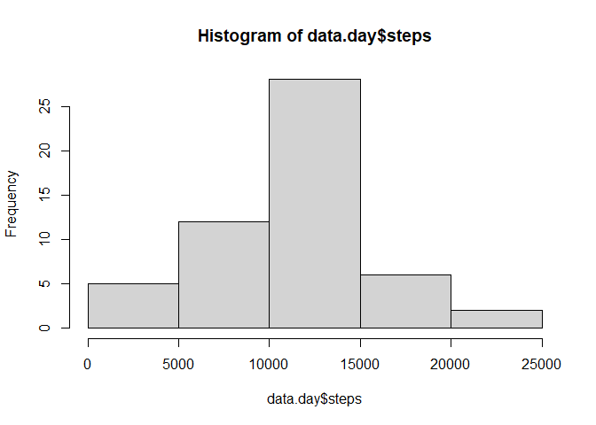

## Loading and preprocessing the data

```r
unzip("./activity.zip")
library(ggplot2)
Act.data <- read.csv("./activity.csv")
summary(Act.data)
```

```
##      steps            date              interval     
##  Min.   :  0.00   Length:17568       Min.   :   0.0  
##  1st Qu.:  0.00   Class :character   1st Qu.: 588.8  
##  Median :  0.00   Mode  :character   Median :1177.5  
##  Mean   : 37.38                      Mean   :1177.5  
##  3rd Qu.: 12.00                      3rd Qu.:1766.2  
##  Max.   :806.00                      Max.   :2355.0  
##  NA's   :2304
```

```r
head(Act.data)
```

```
##   steps       date interval
## 1    NA 2012-10-01        0
## 2    NA 2012-10-01        5
## 3    NA 2012-10-01       10
## 4    NA 2012-10-01       15
## 5    NA 2012-10-01       20
## 6    NA 2012-10-01       25
```

```r
names(Act.data)
```

```
## [1] "steps"    "date"     "interval"
```

## What is mean total number of steps taken per day?


```r
data.day <- aggregate(steps ~ date, Act.data, sum, na.rm=TRUE)
data.day
```

```
##          date steps
## 1  2012-10-02   126
## 2  2012-10-03 11352
## 3  2012-10-04 12116
## 4  2012-10-05 13294
## 5  2012-10-06 15420
## 6  2012-10-07 11015
## 7  2012-10-09 12811
## 8  2012-10-10  9900
## 9  2012-10-11 10304
## 10 2012-10-12 17382
## 11 2012-10-13 12426
## 12 2012-10-14 15098
## 13 2012-10-15 10139
## 14 2012-10-16 15084
## 15 2012-10-17 13452
## 16 2012-10-18 10056
## 17 2012-10-19 11829
## 18 2012-10-20 10395
## 19 2012-10-21  8821
## 20 2012-10-22 13460
## 21 2012-10-23  8918
## 22 2012-10-24  8355
## 23 2012-10-25  2492
## 24 2012-10-26  6778
## 25 2012-10-27 10119
## 26 2012-10-28 11458
## 27 2012-10-29  5018
## 28 2012-10-30  9819
## 29 2012-10-31 15414
## 30 2012-11-02 10600
## 31 2012-11-03 10571
## 32 2012-11-05 10439
## 33 2012-11-06  8334
## 34 2012-11-07 12883
## 35 2012-11-08  3219
## 36 2012-11-11 12608
## 37 2012-11-12 10765
## 38 2012-11-13  7336
## 39 2012-11-15    41
## 40 2012-11-16  5441
## 41 2012-11-17 14339
## 42 2012-11-18 15110
## 43 2012-11-19  8841
## 44 2012-11-20  4472
## 45 2012-11-21 12787
## 46 2012-11-22 20427
## 47 2012-11-23 21194
## 48 2012-11-24 14478
## 49 2012-11-25 11834
## 50 2012-11-26 11162
## 51 2012-11-27 13646
## 52 2012-11-28 10183
## 53 2012-11-29  7047
```

```r
hist(data.day$steps)
```

<!-- -->

```r
mean.day<-mean(data.day$steps)
mean.day
```

```
## [1] 10766.19
```

```r
median.day<-median(data.day$steps)
median.day
```

```
## [1] 10765
```

## What is the average daily activity pattern?

```r
data.Interval<-aggregate(steps~interval, Act.data, mean, na.rm=TRUE)
 
plot(steps~interval, data.Interval, type="l")
```

<!-- -->

```r
max.data.Interval <- data.Interval[which.max(data.Interval$steps),]$interval
max.data.Interval
```

```
## [1] 835
```


## Imputing missing values

```r
missing.data<-sum(is.na(Act.data$steps))
missing.data
```

```
## [1] 2304
```

```r
##replacing  missing data 
Act.data$steps2 <- ifelse(is.na(Act.data$steps), round(data.Interval$steps[match(Act.data$interval, data.Interval$interval)],0), Act.data$steps)
##creating new dataframe(no missing values)
Act.data2 <- data.frame(steps=Act.data$steps2, interval=Act.data$interval, date=Act.data$date)
head(Act.data2)
```

```
##   steps interval       date
## 1     2        0 2012-10-01
## 2     0        5 2012-10-01
## 3     0       10 2012-10-01
## 4     0       15 2012-10-01
## 5     0       20 2012-10-01
## 6     2       25 2012-10-01
```

```r
 data.day2 <- aggregate(Act.data2$steps, list(Act.data2$date),sum)
colnames(data.day2) <- c("Date", "Steps")
 
g <- ggplot(data.day2, aes(Steps))
g+geom_histogram()+ggtitle("histogram of the total number of steps taken each day")+xlab("Steps")+ylab("Frequency")
```

```
## `stat_bin()` using `bins = 30`. Pick better value with `binwidth`.
```

<!-- -->

```r
mean(data.day2$Steps)
```

```
## [1] 10765.64
```

```r
median(data.day2$Steps)
```

```
## [1] 10762
```


## Are there differences in activity patterns between weekdays and weekends?

```r
Act.data2$date2 <- as.Date(Act.data2$date, format = "%Y-%m-%d")
Act.data2$weekday <- weekdays(Act.data2$date2)
Act.data2$level <- ifelse(Act.data2$weekday=="Saturday" | Act.data2$weekday=="Sunday", yes="weekend",no="weekday")

head(Act.data2)
```

```
##   steps interval       date      date2 weekday   level
## 1     2        0 2012-10-01 2012-10-01  Monday weekday
## 2     0        5 2012-10-01 2012-10-01  Monday weekday
## 3     0       10 2012-10-01 2012-10-01  Monday weekday
## 4     0       15 2012-10-01 2012-10-01  Monday weekday
## 5     0       20 2012-10-01 2012-10-01  Monday weekday
## 6     2       25 2012-10-01 2012-10-01  Monday weekday
```

```r
library(lattice)
 
xyplot(steps ~ interval | level, Act.data2, type = "l", layout = c(1, 2), 
    xlab = "Interval", ylab = "Steps")
```

<!-- -->
